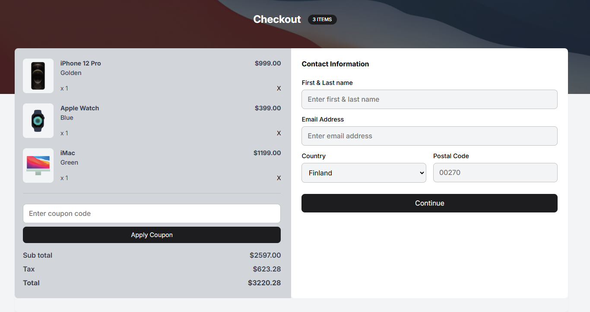

<!-- Please update value in the {}  -->

<h1 align="center">Device Shop Chekout | devChallenges</h1>

   Solution for a challenge <a href="https://devchallenges.io/challenge/apple-shop-checkout-page-challenge" target="_blank">Device Shop Checkout</a> from <a href="http://devchallenges.io" target="_blank">devChallenges.io</a>.

  <h3>
    <a href="https://gustavo2023.github.io/device-shop-checkout/">
      Demo
    </a>
     | 
    <a href="{https://your-url-to-the-solution}">
      Solution
    </a>
     | 
    <a href="https://devchallenges.io/challenge/apple-shop-checkout-page-challenge">
      Challenge
    </a>
  </h3>

<!-- TABLE OF CONTENTS -->

## Table of Contents

- [Overview](#overview)
  - [What I learned](#what-i-learned)
- [Built with](#built-with)
- [Features](#features)

<!-- OVERVIEW -->

## Overview

This project is a device shop checkout page created as a submission to a DevChallenges challenge. The goal was to build a responsive checkout page using HTML and CSS. The page includes features such as displaying product details, the total price, and a form for entering contact information.

### What I learned

- **Responsive Design**: I used CSS Grid and Flexbox to create a flexible layout that works well on both large and small screens.

### Built with

- Semantic HTML5 markup
- CSS custom properties
- Flexbox
- CSS Grid

## Features

- **Product Display**: The page displays a list of products with their images, names, prices, and quantities.
- **Coupon Code**: Users can enter a coupon code to apply discounts.
- **Contact Form**: A form for entering contact information, including name, email, country, and postal code.

This application/site was created as a submission to a [DevChallenges](https://devchallenges.io/challenges-dashboard) challenge.

## Author

- GitHub [@gustavo2023](https://github.com/gustavo2023)
